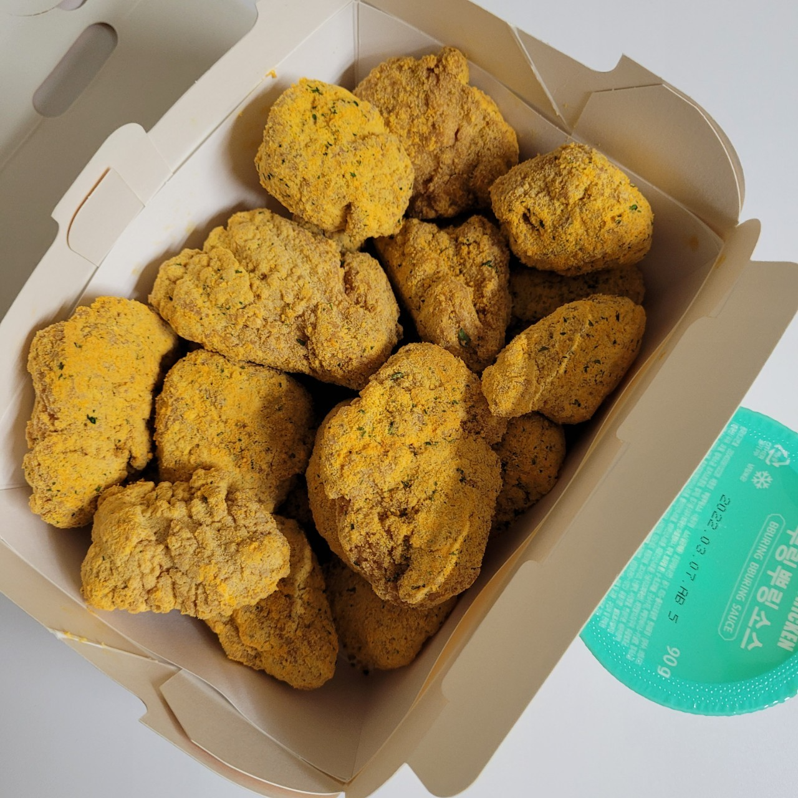

## lelle.bot (디스코드 렐레 봇)
  

lelle(렐레) `2021. 12. 15` 개발 시작 

## 소개
렐레는 유용한 기능이 담긴 디스코드 봇 입니다. 
<a href="https://discord.com/api/oauth2/authorize?client_id=920613928202018899&permissions=8&scope=bot" target="_blank">서버에 봇 초대하기</a> 

## 정보
- 개발 언어: `python3.8`
- 접두사: `u`
- 라이선스: `MIT LICENSE`
- 개발자: `ulhangry` ('^'#2854)
- 도움을 준 사람: `lesh` (LESH#3201)

## 라이선스 (MIT)
<a href="LICENSE">라이선스 내용</a> 

- 렐레의 소스는 누구라도 무상으로 제한없이 취급 가능합니다.
- 렐레의 소스 취급시 사용한 소프트웨어의 저작권 허가 표시를 모든 복제물이나 중요한 부분에 기재 해주세요

